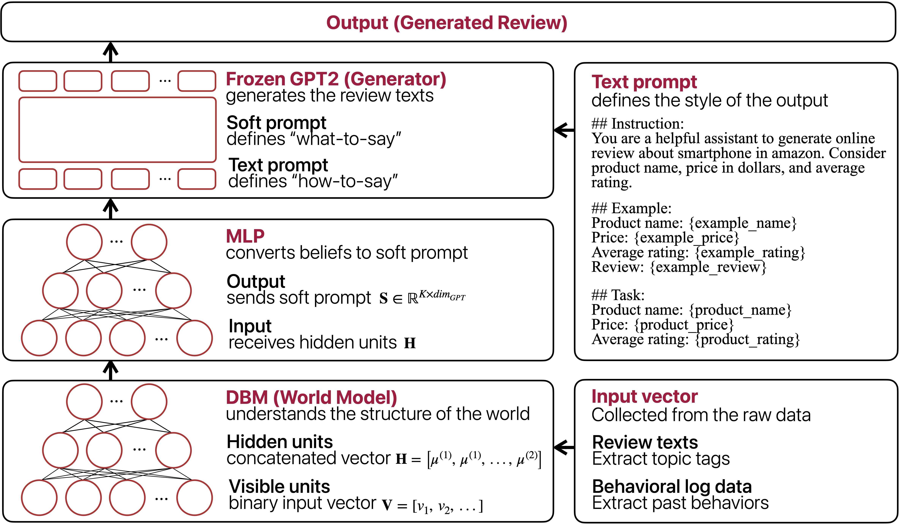

# The Mouth is Not the Brain

**Bridging Energy-Based World Models and Language Generation**

Accepted at the **ICLR 2026 the 2nd Workshop on World Models: Understanding, Modelling and Scaling**.

[](https://doi.org/10.48550/arXiv.2601.17094)
[](https://arxiv.org/abs/2601.17094)

- 📝 **arXiv:** [2601.17094](https://arxiv.org/abs/2601.17094) (doi: 10.48550/arXiv.2601.17094)
- 📚 **BibTeX:** [Niimi2026.bib](./Niimi2026.bib)

---

## Author

**Dr. Junichiro Niimi** (Japan)

- Associate Professor
- Faculty of Business Management, Meijo University
- Nagoya, Aichi 468-8502, Japan
- 📧 [jniimi@meijo-u.ac.jp](mailto:jniimi@meijo-u.ac.jp)
- 🔗 [researchmap](https://researchmap.jp/jniimi?lang=en)
- 📄 [CV (PDF)](https://jniimilab.ai/cv.pdf)

---

## TL;DR

LLMs speak fluently, but do they *understand* the world? We propose an architectural principle — **the mouth is not the brain** — that separates world modeling from language generation. A Deep Boltzmann Machine (DBM) learns domain structure as an energy-based world model, an adapter projects latent belief states into embedding space, and a **frozen GPT-2** renders them as fluent text.

Evaluated on Amazon smartphone reviews, this separation:

1. **Outperforms** direct projection and full fine-tuning baselines on cross-entropy and semantic similarity.
2. Produces an **inspectable energy function** that assigns higher energy to implausible brand–price configurations.
3. Supports **causal interventions**: editing attributes propagates to generated text with distributions statistically consistent with real samples sharing the target configuration.

Even small language models can generate consistent, controllable text when connected to an appropriate world model.

---


---

## Why Separate the World Model from the Language Model?

1. **Reusable brain.** Once domain structure is learned, the same world model can drive different "mouths" — text, images, classifiers. Only the output modality changes.
2. **Interpretable beliefs.** The DBM's energy function is inspectable: we can see what the model considers coherent before it speaks.
3. **Counterfactuals, not prompt hacking.** Clamp a variable, re-equilibrate via mean-field, generate. The intervention propagates through learned belief structure — not through string substitution in a prompt.
4. **Compute should flow to the brain, not the mouth.** Current practice scales the language model. We argue the opposite: invest in rich world models and connect commodity LLMs as output devices.

### Conditional vs. Interventional Generation

| | Conditional (standard) | Interventional (this work) |
|--|--|--|
| Formulation | `P(text \| Brand=Apple, Rating=5)` | `P(text \| do(Brand=Apple), do(Rating=5))` |
| Question | "What text is associated with these features?" | "If we *set* these beliefs, what text emerges?" |
| Captures | Correlation | Causal contribution |

---

## Architecture



- **World model:** DBM with 1 visible + 2 hidden layers, trained via layer-wise pretraining (CD) and joint fine-tuning (PCD).
- **Adapter:** MLP mapping concatenated mean-field activations to `K` soft prompt embeddings.
- **Language model:** GPT-2, fully frozen throughout training and inference.

Only the adapter is updated during end-task training.

---

## Scope & Limitations

- **Small LM by design.** GPT-2 is used deliberately — pairing a limited language model with an explicit world model lets us isolate the causal contribution of world-model conditioning, which frontier LLMs would obscure by internalizing implicit world knowledge.
- **Co-occurrence, not temporal dynamics.** The DBM captures which attribute configurations are coherent (market regularities), not sequential state evolution. Extending to temporal world models is future work.
- **One domain.** Results on Amazon smartphone reviews may not directly transfer to other product categories, languages, or domains.

---

## Citation

Download: [Niimi2026.bib](./Niimi2026.bib)

```bibtex
@inproceedings{niimi2025mouth,
  title     = {The Mouth is Not the Brain: Bridging Energy-Based World Models and Language Generation},
  author    = {Niimi, Junichiro},
  booktitle = {ICLR 2026 the 2nd Workshop on World Models: Understanding, Modelling and Scaling},
  year      = {2026},
  eprint    = {2601.17094},
  archivePrefix = {arXiv},
  primaryClass  = {cs.CL},
  doi       = {10.48550/arXiv.2601.17094},
  url       = {https://openreview.net/forum?id=GjyyyRyrWO}
}
```

---

## Selected Publications

A selection from prior work. Full list: [researchmap](https://researchmap.jp/jniimi?lang=en).

**On LLM behavior & limitations**
- *Hallucinate or Memorize? The Two Sides of Probabilistic Learning in Large Language Models* — ICAART 2026.
- *Reference Points in LLM Sentiment Analysis: The Role of Structured Context* — PACLIC 39, 2025.
- *Stable LLM Ensemble: Interaction between Example Representativeness and Diversity* — Springer LNNS, 2025.
- *A Simple Ensemble Strategy for LLM Inference: Towards More Stable Text Classification* — Springer LNCS, 2025.

**Other selected journal publications**
- *Handling the Inconsistency between Self-Report and the Actual Behavior* — International Journal of Market Research, 2023.
- *Public Perceptions, Individual Characteristics, and Preventive Behaviors for COVID-19 in Six Countries* — Environmental Health and Preventive Medicine, 2021.

**Funded project (PI)**
- *Interpretable Multimodal Deep Learning Models for Marketing* — JSPS KAKENHI 24K16472 (2024–2027).

---

## Contact

Questions, comments, or collaboration ideas welcome — please reach out by email.

### Looking for collaborators & compute

I'm actively looking to bring this line of work to a wider international audience. If you're a **graduate student, researcher, or company** curious about *AI research from a slightly unusual angle* — separating world models from language, energy-based cognition, interventional generation — I'd love to hear from you.

Particularly welcome:

- 🤝 **Research collaborations** (academic or industrial)
- 🖥 **Compute sponsorship / GPU resources** — scaling these experiments to larger LMs is currently the main bottleneck
- 🏫 **Visiting positions, short research stays, seminar invitations**
- 💬 **Informal chats** — happy to discuss ideas even without a concrete project
